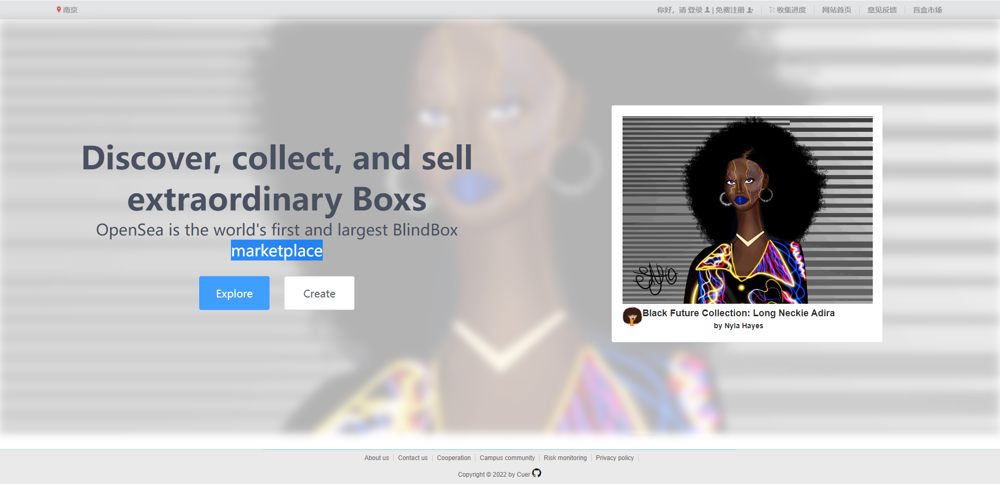
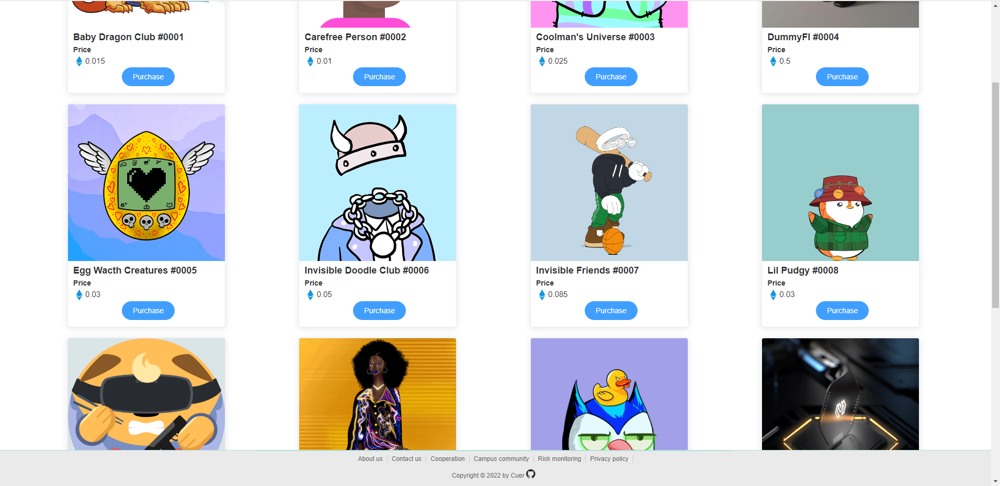

# BlindBox-marketplace
[](https://travis-ci.com/PowerDos/Mall-Vue)
[](https://vuejs.org/)
[](https://standardjs.com)
[](https://github.com/PowerDos/Mall-Vue)
[](https://standardjs.com)
[](https://standardjs.com)
[](https://standardjs.com)
[](https://standardjs.com)

> 这是一个基于VUE + VUEX + Element-UI 做的一个前端项目。

> 起因是学校的实训要求完成一个盲盒交易市场的项目，可因为疫情的原因，实训上到一半就没了下文，项目只粗略完成的前端的设计。我打算做一个和传统电商完全不一样的marketplace，于是在前端中加入了Web3.0的元素，用NFT替换了盲盒，变成NFT盲盒，参考了[OpenSea](https://opensea.io/)的网页前端。


## Build Setup

### Using Node
``` bash
# 安装依赖
npm install

# 开发模式
npm run dev

# 打包
npm run build

view url: http://127.0.0.1:8080
```

## PAGE




